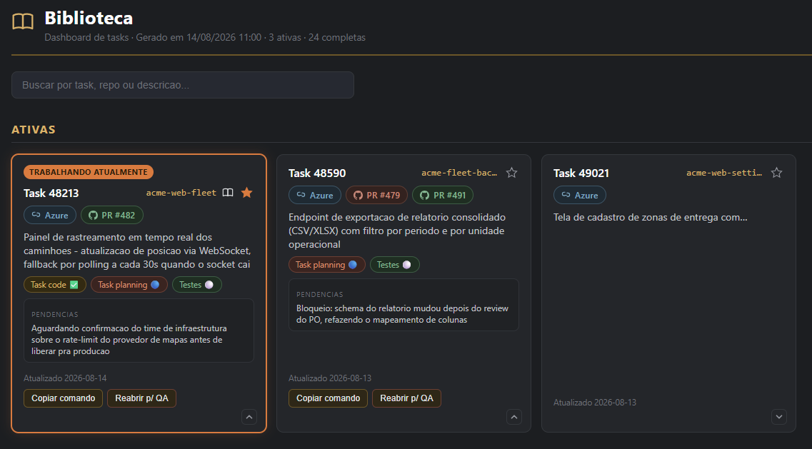
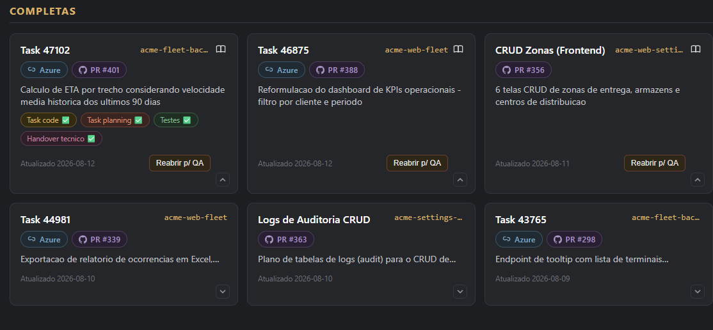
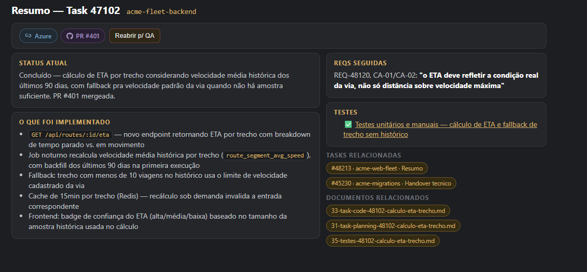

# 📚 Biblioteca

**A memória de todo o seu trabalho, a um clique — sem abrir repo, sem procurar arquivo.**


Toda spec, plano, teste e playbook técnico que você já escreveu, buscável e
navegável num dashboard visual — retome, conclua ou reabra qualquer task sem
abrir um repo ou caçar arquivo na memória. Markdown puro, versionado em Git,
sem banco de dados, sem servidor, sem build.

> As telas abaixo usam dados fictícios (empresa/tasks inventadas) só pra
> ilustrar — a Biblioteca real acompanha trabalho de verdade.

**Ver também:** [`01-regras-biblioteca.md`](01-regras-biblioteca.md) (regras
detalhadas) · [`INDEX.md`](INDEX.md) (tasks em andamento) ·
[`CATALOGO.md`](CATALOGO.md) (histórico completo)

## O dashboard

Uma página só, gerada a partir dos `.md` da própria pasta. Fica salva nos
favoritos do navegador — abre sem terminal, sem servidor, sem login.



- **Estado real do PR e do Azure DevOps, sem abrir nada** — verde = aberto,
  roxo = mergeado, vermelho = fechado sem merge. A cor vem de uma checagem
  automática via `gh`, não de suposição.
- **Pendências em destaque** no próprio card — se o doc menciona "aguardando"
  ou "bloqueio", aparece ali, sem precisar ler o markdown inteiro.
- **Botões copiam o comando certo** pro terminal — retomar, reabrir pra QA —
  cada um já sabe a task e o repo, sem digitar nada.
- **Favoritar** uma task ativa fixa ela no topo com destaque visual — 100%
  local (`localStorage`), não mexe em nenhum arquivo.



- **Cards compactos por padrão** — a grade inteira cabe na tela; expandir um
  revela os documentos ligados àquela task (spec, plano, testes, handover)
  cada um com seu emoji de status.
- **Busca instantânea** por task, repo ou descrição, sem round-trip nenhum —
  filtra a grade enquanto digita.
- **Tasks "gerais"** (sem número de card formal) ganham nome próprio via
  `cluster:`, em vez de ficarem todas empilhadas como "Geral".

### Resumo por task — a página que resolve "o que foi feito mesmo?"



Clicar no ícone de livro abre um resumo de uma task específica: o que foi
implementado (nomeando campo/endpoint/tela, não "fiz a feature"), qual REQ
motivou, quais testes já rodaram — e a parte que mais economiza tempo:

- **Tasks relacionadas** — quando a mesma entrega vira card em mais de um
  repo (frontend + backend + uma migration à parte, por exemplo), o resumo
  de um linka pro resumo do outro **automaticamente**, por task numérica
  ou por cluster igual. Não depende de ninguém lembrar de linkar na mão.
- Link do Azure e de todos os PRs relacionados juntos, na mesma caixa dos
  botões de ação — não espalhados pela página.

### "+ Nova Task" — abre o Claude já no repo certo, sem digitar path

Botão no header abre um formulário (link do Azure, repo, descrição) — o
prompt se monta sozinho numa caixa ao lado, ajustável antes de enviar.
"Abrir Claude" copia o comando e tenta abrir direto um terminal já na
pasta do repositório escolhido, via um protocolo customizado
(`biblioteca-cmd:`, registro único por máquina — opcional, sem ele cai no
fallback de sempre: copia pro clipboard). Se o MCP `azure-devops`
(somente leitura, ver abaixo) estiver conectado, o Claude busca sozinho o
REQ e o item pai daquele work item antes de gravar qualquer documento —
mostra o link encontrado e pede uma confirmação objetiva, nunca escreve
de volta no Azure.

O mesmo header também tem um botão **"Abrir Claude"** — abre uma janela
solta em qualquer repo do datalist, sem task nem skill nenhuma disparando,
só pra conversar.

### Outros recursos

- **Pendências** — quando um `resumo` fica pra trás (a task já não está
  mais ativa, mas o resumo ainda diz "rascunho"), aparece aqui. Marque as
  que quiser revisar e copie um comando pronto pra pedir ao agente que
  confira o merge real e corrija a documentação, em lote.
- **Paleta de cores** — referência visual de todo ícone/cor usado, sem
  precisar achar um card real que use cada um.
- **Arquivo** — planos superados ou substituídos não somem: viram um link
  numa página separada, só pra consulta quando precisar do histórico.

---

## Cadastro e uso

### Cadastro (uma vez, por máquina)

Não tem passo manual — clone o repo, abra uma sessão do Claude Code dentro
dele, e a skill `biblioteca-setup` dispara sozinha na primeira vez (detecta
que `biblioteca.config.json` ainda não existe). Ela pergunta, uma de cada
vez:

1. **Seu nome** — vira o autor dos documentos que você criar.
2. **Onde ficam os repositórios dos seus projetos** — pra saber onde entrar
   quando você pedir pra retomar uma task.
3. **Um link de task do Azure DevOps, se você usar** — cola qualquer uma
   que já exista e a Biblioteca extrai a organização sozinha. Se o MCP
   `azure-devops` já estiver configurado nessa máquina, o Claude também
   testa a conexão nesse momento (busca aquele work item de verdade e
   mostra o título encontrado). Não usa Azure DevOps? Pula essa pergunta —
   a pill correspondente simplesmente não aparece em nenhum card.

No fim, ela grava `biblioteca.config.json` (arquivo pessoal, fora do Git) e
já roda a primeira sincronização — o dashboard abre pronto pra uso.

### Uso do dia a dia

- **Criar um documento novo** — peça ao Claude ("cria um task-code pra
  essa task", "documenta esse módulo"); a skill `controle-documentacao`
  cuida do resto (template certo, frontmatter, onde salvar, sincronizar).
- **Abrir o dashboard** — `dashboard-visual/dashboard.html`, salvo nos
  favoritos do navegador. É o ponto de entrada de todo dia — busca, retoma,
  vê o que falta.
- **Retomar/concluir/reabrir uma task** — clique em "Retomar task" ou
  "Reabrir p/ QA" no card (ou na página de resumo) — abre um terminal já
  com o comando digitado (ou copia pro clipboard, se o protocolo não
  estiver registrado). O comando já sabe a task e o repo — a skill certa
  (`task-hub-resume`/`task-hub-qa`) assume a partir daí.

## Detalhes técnicos

Cada task vira um ou mais arquivos `.md` com YAML na frente — sem banco de
dados, sem API, sem servidor. O dashboard é 100% derivado desses arquivos.

```
Agente implementa algo
    → REQ/pedido original salvo em reqs/ (verbatim)
    → classifica o tipo (task-code, task-planning, testes, resumo, handover-tecnico)
    → grava em {tipo}/frontend/ ou {tipo}/backend/
    → atualiza status no YAML
    → toca o `resumo` da task+repo a cada mudança (não só no fim)
    → roda scripts/sync-all.ps1 → dashboard.html atualizado
```

### Estrutura

```
Biblioteca/
├── INDEX.md                 # gerado — não editar
├── CATALOGO.md               # histórico completo, gerado
├── 01-regras-biblioteca.md
├── _ferramenta/              # o "motor" — scripts, dashboard, screenshots
│   ├── scripts/
│   │   ├── sync-all.ps1      # rodar após cada edição
│   │   ├── lint-clusters.ps1 # trava colisão de cluster/resumo antes de gerar
│   │   └── lib-doc.ps1       # parsing/geração compartilhado
│   ├── dashboard-visual/     # gerador do dashboard + skills locais
│   └── docs/screenshots/     # imagens usadas neste README
├── _templates/{tipo}.md
├── task-code/{frontend,backend}/
├── task-planning/{frontend,backend}/
├── testes/{frontend,backend}/
├── resumo/{frontend,backend}/
├── handover-tecnico/{frontend,backend}/
├── reqs/                     # REQ original verbatim, fora do índice numerado
└── _archive/                 # planos/resumos superados (ver pág. "Arquivo")
```

### Tipos de documento

| Tipo | Uso |
|------|-----|
| `task-code` | Card do seu rastreador de tarefas / especificação técnica da branch |
| `task-planning` | Plano de execução; planos grandes viram seções no mesmo arquivo |
| `testes` | Unitários e manuais no **mesmo** documento por task |
| `resumo` | Um doc por task+repo — dado factual que alimenta o dashboard |
| `handover-tecnico` | Conceitos técnicos pra quem (ou qual IA) pegar depois |
| `reqs` | REQ/card original colado verbatim, referência crua |

### Status

| Valor | Significado |
|-------|-------------|
| `draft` | Rascunho |
| `in_progress` | Em implementação ou testes |
| `completed` | Entregue (testes OK + commit/PR) |
| `superseded` | Substituído por outro documento (`related` aponta o novo) |
| `archived` | Histórico — some do dashboard principal, some pra `_archive/` |

### Sincronização

```powershell
powershell -ExecutionPolicy Bypass -File scripts/sync-all.ps1
```

Roda o lint de consistência, regenera `INDEX.md`/`CATALOGO.md` e o dashboard
inteiro (`dashboard.html`, `paleta.html`, `archive.html`, um `resumo-*.html`
por task). Também dispara sozinho pelo hook `SessionStart` sempre que uma
sessão do Claude Code abre dentro de `dashboard-visual/`.

### Skills do agente

| Skill | Papel |
|-------|-------|
| `controle-documentacao` | Criar, editar, status e indexação — gate obrigatório antes de gravar qualquer doc |
| `task-hub-resume` / `task-hub-complete` / `task-hub-qa` | Acionadas pelos botões do dashboard (`dashboard-visual/.claude/skills/`) |
| *(suas skills de teste, se tiver)* | Alimentam a seção de testes de cada task |

### Limitações

- **Windows-only.** Scripts são `.ps1`, sem versão para Linux/macOS.
- **Single-user, sem sincronização entre máquinas.** Favorito/"atual" fica
  em `localStorage` do navegador — abrir em outro computador não traz o
  destaque, só os dados versionados no Git.
- **Cor de PR/Azure depende de `gh` autenticado.** Sem isso, os pills
  aparecem no estado neutro (cinza), não quebram, só não colorem.
- **Pill do Azure é opcional** — configurável em `biblioteca.config.json`
  (`azureOrgUrl`); sem esse campo, ela simplesmente não aparece. Não usa
  Azure DevOps? Deixe em branco.
- **Atualização por reload, não por push.** O dashboard recarrega a página
  inteira a cada 20s (preservando busca, cards abertos e scroll) pra
  refletir mudanças salvas por `sync-all.ps1` — não é uma atualização
  instantânea via servidor, é uma releitura periódica do arquivo estático.
- **Protocolo `biblioteca-cmd:` é opcional, por máquina.** Sem rodar
  `dashboard-visual/scripts/register-protocol.ps1` uma vez, os
  botões de ação continuam funcionando no fallback de sempre (copiar pro
  clipboard) — só não abrem o terminal sozinhos.
- **MCP `azure-devops` é opcional e somente leitura.** Sem ele, "+ Nova
  Task" ainda funciona — só não preenche REQ/parent sozinho, você digita
  na mão. Quando conectado, é travado em 3 camadas (PAT com escopo
  "Work Items: Read", `permissions.deny` global e instrução embutida no
  prompt) pra nunca escrever de volta no Azure DevOps.

### Git

Repo privado no GitHub, branch `main`:

```powershell
git add -A
git commit -m "docs: ..."
git push
```
