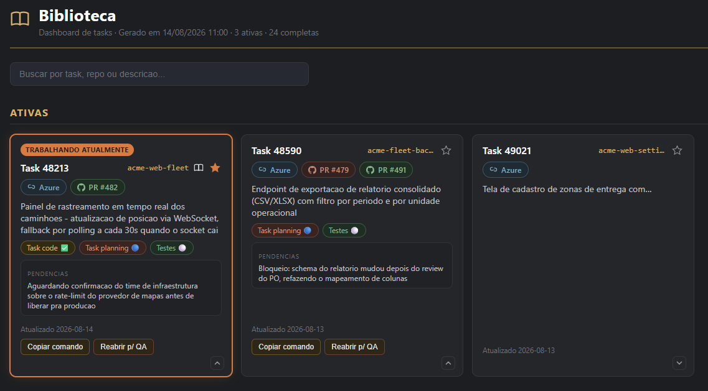
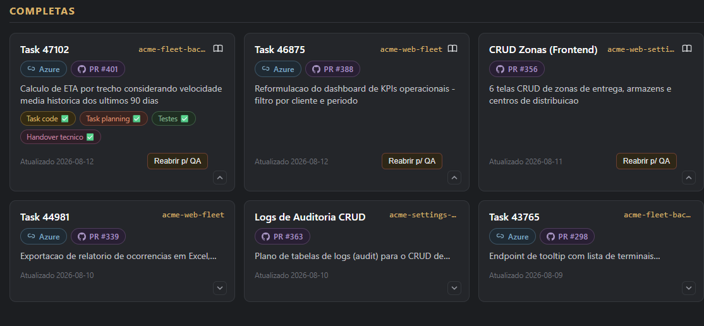
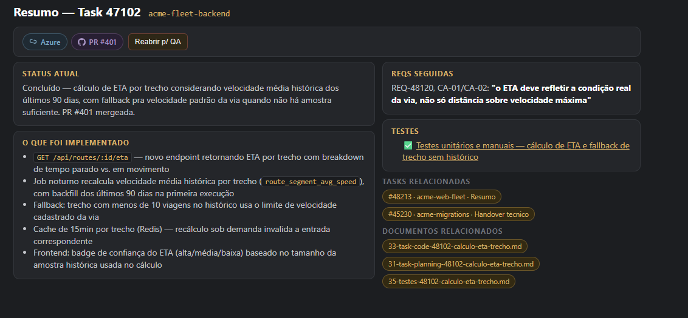

# 📚 Biblioteca

**A memória de todo o seu trabalho, a um clique — sem abrir repo, sem procurar arquivo.**


Spec, plano, teste e handover de cada task, num dashboard visual gerado a
partir de Markdown puro versionado em Git. Sem banco, sem servidor, sem
build. O agente (Claude Code) escreve os documentos; você navega.

> Telas com dados fictícios, só pra ilustrar.

## O dashboard

Uma página HTML estática, salva nos favoritos do navegador.



- **Estado real do PR e do Azure DevOps** — verde aberto, roxo mergeado,
  vermelho fechado (checado via `gh`).
- **Pendências no card** — "aguardando"/"bloqueio" no doc aparece direto ali.
- **Botões de ação** — retomar task ou reabrir pra QA abrem o terminal com
  o comando pronto.



- Cards compactos, busca instantânea por task/repo/descrição, favoritos
  fixados no topo.



- **Resumo por task** — o que foi implementado, qual REQ motivou, testes
  feitos e links pros cards da mesma entrega em outros repos.
- **+ Nova Task** — formulário que abre o Claude já no repo certo, com o
  prompt montado (e o REQ buscado no Azure DevOps, se o MCP estiver ligado).

## Começando

1. No GitHub, clique em **"Use this template"** (não clone nem dê fork deste
   repo — ele é o starter kit limpo) e clone o repo criado.
2. Abra o Claude Code dentro dele. A skill `biblioteca-setup` pergunta seu
   nome, a pasta dos seus repos e (opcional) um link do Azure DevOps, grava
   `biblioteca.config.json` e abre o dashboard.
3. Opcional: peça *"roda a skill importar-historico-github"* pra povoar o
   dashboard com seus PRs antigos.

> Setup não disparou sozinho? Peça: *"roda a skill biblioteca-setup"*.

No dia a dia, peça ao Claude ("cria um task-code pra essa task") — a skill
`controle-documentacao` escolhe template, pasta, frontmatter e roda o sync.

## Como funciona

Cada task vira `.md` com frontmatter YAML em pastas por tipo (`task-code/`,
`task-planning/`, `testes/`, `resumo/`, `handover-tecnico/`, `progresso/`,
`reqs/`). O `sync-all.ps1` lê tudo e regenera `INDEX.md`, `CATALOGO.md` e o
dashboard:

```powershell
powershell -ExecutionPolicy Bypass -File scripts/sync-all.ps1
```

Tipos, status, nomenclatura e estrutura completa:
[`01-regras-biblioteca.md`](01-regras-biblioteca.md).

### Skills incluídas

| Skill | Papel |
|-------|-------|
| `controle-documentacao` | Gate pra criar/editar qualquer doc (template, status, sync) |
| `biblioteca-setup` | Cadastro guiado na primeira sessão |
| `importar-historico-github` | Gera `resumo/` a partir dos seus PRs no GitHub |
| `biblioteca-pdf-export` | Converte um doc em PDF no tema do dashboard (pra mandar pra PO/QA) |
| `task-hub-resume` / `-qa` / `-complete` | Acionadas pelos botões do dashboard |

Ficam em `.claude/skills/` e `dashboard-visual/.claude/skills/` — carregam
sozinhas ao abrir o Claude Code no repo.

## Limitações

- **Só Windows** (scripts `.ps1`).
- **Um usuário, local** — favoritos ficam no `localStorage` do navegador.
- **Cores de PR exigem `gh` autenticado**; sem ele os pills ficam cinza.
- **Opcionais:** Azure DevOps (`azureOrgUrl` no config), protocolo
  `biblioteca-cmd:` (`register-protocol.ps1`, sem ele os botões só copiam
  pro clipboard) e MCP `azure-devops` (somente leitura).
